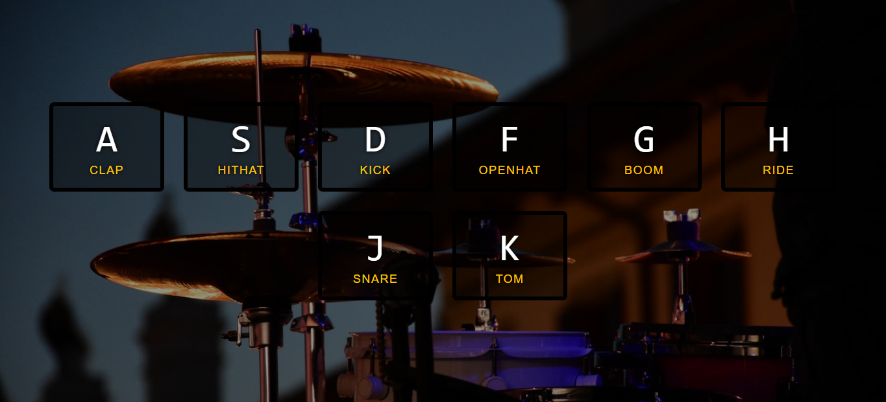

# Drum Kit

Drum kit simulator. You can emulate the main sounds of a drum by pressing from "A" to "K" in your keyword and also by clicking or touching them on your screen.

This project is part of the "30 Day Vanilla JS Coding Challenge"

Challenge link: https://javascript30.com/

## GitHub 

Repository Link: https://github.com/LucianoCanziani/Drum-Kit-Simulator.git

## Deploy Netlify

Deploy Link: https://626aaabb81db6823f1a6fa43--drumkitsimulator.netlify.app/